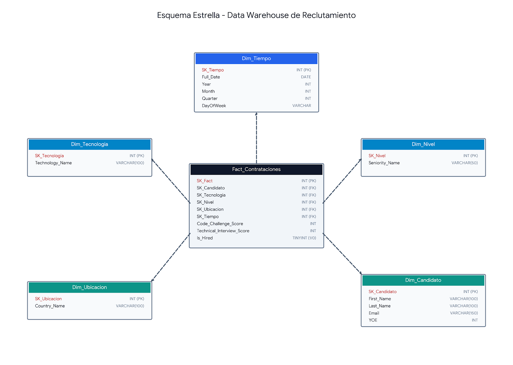
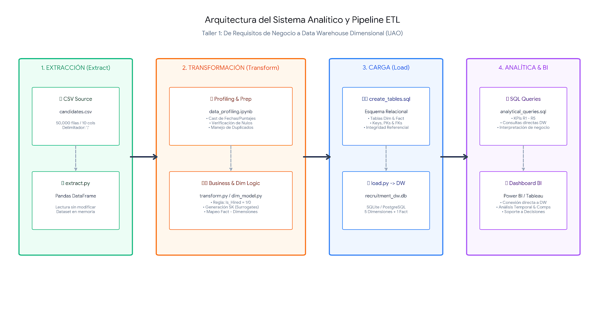

# Workshop 1: From Business Requirements to a Dimensional Data Warehouse

**Universidad Autónoma de Occidente**  
**Facultad de Ingeniería y Ciencias Básicas**  
**Programa:** Ingeniería de Datos e Inteligencia Artificial  
**Curso:** ETL (G01) - 2026-2  

---

## 1. Contexto de Negocio y Objetivo del Proyecto

### Contexto de Negocio
Una empresa global de reclutamiento tecnológico procesa miles de postulaciones de candidatos con diversos antecedentes profesionales, niveles de experiencia, países y perfiles tecnológicos. El rendimiento de cada candidato se evalúa mediante dos pruebas clave:
* **Code Challenge Score:** Puntuación del reto de programación (0 a 10).
* **Technical Interview Score:** Puntuación de la entrevista técnica (0 a 10).

Actualmente, los datos operativos se encuentran dispersos en un archivo plano (`candidates.csv`). La organización necesita un **sistema analítico centralizado** que permita a los tomadores de decisiones analizar patrones de contratación y optimizar la efectividad del proceso de selección.

### Objetivo
Diseñar, construir e implementar un **Data Warehouse Dimensional (Esquema Estrella)** junto con una tubería **ETL reproducible en Python**, que transforme los datos crudos en información estratégica para resolver 5 requisitos clave de negocio.

---

## 2. Requisitos de Negocio (Business Requirements)

* **R1 - Hiring Trends (Tendencias de Contratación):** Monitorear las tendencias de contratación a lo largo del tiempo para identificar variaciones en los resultados del reclutamiento.
* **R2 - Technology Analysis (Análisis Tecnológico):** Comparar resultados entre tecnologías para identificar los perfiles técnicos con mayor volumen y tasa de contratación.
* **R3 - Candidate Profile Analysis (Perfil del Candidato):** Analizar los resultados de contratación según la antigüedad (*Seniority*) y los años de experiencia (*YOE*).
* **R4 - Geographic Recruitment Analysis (Propuesto):** Identificar los países con mayor volumen de solicitudes y evaluar su efectividad de contratación para orientar la estrategia de reclutamiento geográfico.
* **R5 - Technical Evaluation Efficiency & Bottlenecks (Propuesto):** Evaluar el embudo de filtrado técnico midiendo la tasa de aprobación conjunta e individual en el Reto de Código y la Entrevista Técnica para identificar cuellos de botella operacionales.

---

## 3. Matriz de Trazabilidad de Requisitos (Requirements Traceability)

| Requisito | Pregunta de Negocio | Datos Requeridos | Salida Analítica Esperada |
| :--- | :--- | :--- | :--- |
| **R1** | ¿Cómo ha evolucionado la tasa y volumen de contratación por año? | `Application Date`, `Code Challenge Score`, `Technical Interview Score` | Tasa de contratación (%) y conteo anual de contratados vs solicitudes. |
| **R2** | ¿Cuáles tecnologías generan la mayor cantidad de contratados y mayor tasa de conversión? | `Technology`, `Code Challenge Score`, `Technical Interview Score` | Ranking de tecnologías por contratados totales y % de efectividad. |
| **R3** | ¿Existen diferencias significativas en la tasa de contratación según el nivel de Seniority? | `Seniority`, `YOE`, `Code Challenge Score`, `Technical Interview Score` | Métricas de contratación agrupadas por Seniority y promedio de YOE. |
| **R4** | ¿Qué países aportan el mayor volumen de contrataciones efectivas para la estrategia global? | `Country`, `Code Challenge Score`, `Technical Interview Score` | Top de países con mayor tasa de éxito y volumen de postulaciones. |
| **R5** | ¿Dónde se pierden más candidatos (reto de código vs entrevista) y cómo optimizar horas de evaluación? | `Code Challenge Score`, `Technical Interview Score` | Distribución porcentual en categorías de desempeño en pruebas. |

---

## 4. Descripción del Dataset y Profiling Inicial de Datos

El conjunto de datos de origen (`candidates.csv`) contiene solicitudes operativas de candidatos.

### Hallazgos Principales del Profiling (`notebooks/data_profiling.ipynb`):
* **Registros totales:** 50,000 filas y 10 columnas.
* **Delimitador:** Punto y coma (`;`).
* **Valores Nulos:** 0 valores nulos en todas las columnas.
* **Duplicados exactos:** 0 filas duplicadas.
* **Rango Temporal:** Desde `2018-01-01` hasta `2022-07-04`.
* **Atributos Categóricos:**
  * 24 Tecnologías únicas (ej. Game Development, DevOps, System Administration).
  * 7 Niveles de Seniority (Intern, Trainee, Junior, Mid-Level, Senior, Lead, Architect).
  * 244 Países únicos.
* **Estadísticas de Evaluaciones:**
  * `Code Challenge Score`: Rango 0-10, Promedio = 5.00, Mediana = 5.00.
  * `Technical Interview Score`: Rango 0-10, Promedio = 5.00, Mediana = 5.00.
  * `YOE` (Years of Experience): Rango 0-30 años, Promedio = 15.28 años.
* **Tasa de Contratación Global (Regla de Negocio):**
  * Contratados (`HIRED`): 6,698 candidatos (13.40%).
  * No Contratados (`NOT HIRED`): 43,302 candidatos (86.60%).

---

## 5. Modelo de Datos Dimensional (Star Schema)

### Paso 1: Proceso de Negocio
Evaluación y Selección Operativa de Candidatos Tecnológicos.

### Paso 2: Declaración del Grano
> **"Una fila en la Tabla de Hechos (`Fact_Contrataciones`) representa una solicitud individual de empleo enviada por un candidato en una fecha determinada."**

### Paso 3: Definición de Dimensiones

| Dimensión | Propósito Analítico | Atributos Principales | Requisito(s) Soporta |
| :--- | :--- | :--- | :--- |
| **Dim_Tiempo** | Análisis temporal y tendencias. | `SK_Tiempo`, `Full_Date`, `Year`, `Month`, `Quarter`, `DayOfWeek` | R1 |
| **Dim_Tecnologia** | Comparación por perfil técnico. | `SK_Tecnologia`, `Technology_Name` | R2 |
| **Dim_Nivel** | Evaluación por nivel profesional. | `SK_Nivel`, `Seniority_Name` | R3 |
| **Dim_Ubicacion** | Análisis geográfico de candidatos. | `SK_Ubicacion`, `Country_Name` | R4 |
| **Dim_Candidato** | Contexto del postulante. | `SK_Candidato`, `First_Name`, `Last_Name`, `Email`, `YOE` | R3 |

### Paso 4: Hechos y Medidas

| Medida / Hecho | Significado / Tipo | Origen / Cálculo | Requisito(s) Soporta |
| :--- | :--- | :--- | :--- |
| `Code_Challenge_Score` | Desempeño en programación (Semiaditivo). | Directo de fuente (0-10). | R5 |
| `Technical_Interview_Score` | Desempeño en entrevista (Semiaditivo). | Directo de fuente (0-10). | R5 |
| `Is_Hired` | Indicador de contratación (Aditivo). | `1` si (Code >= 7 AND Interview >= 7), sino `0`. | R1, R2, R3, R4, R5 |

### Paso 5: Diagrama del Esquema Estrella


---

## 6. Arquitectura del Sistema y Pipeline ETL


---

## 7. Tecnologías Utilizadas

* **Lenguaje:** Python 3.10+
* **Procesamiento de Datos:** Pandas, NumPy
* **Base de Datos / DW:** SQLite (compatible con PostgreSQL / MySQL)
* **Entorno de Exploración:** Jupyter Notebooks / VS Code
* **Control de Versiones:** Git & GitHub

---

## 8. Instrucciones de Ejecución (Reproducibilidad)

Sigue estos pasos para clonar y ejecutar el proyecto desde cero:

```bash
# 1. Clonar el repositorio
git clone [https://github.com/TU_USUARIO/workshop-1.git](https://github.com/TU_USUARIO/workshop-1.git)
cd workshop-1

# 2. Crear e inactivar entorno virtual (Opcional)
python -m venv venv
# En Windows: venv\Scripts\activate

# 3. Instalar dependencias
pip install -r requirements.txt

# 4. Ejecutar la tubería ETL completa
python src/main.py
