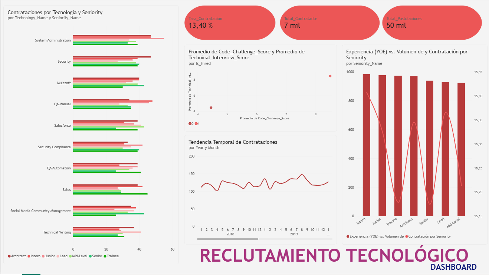

# Workshop 1: From Business Requirements to a Dimensional Data Warehouse

**Universidad Autónoma de Occidente**  
**Facultad de Ingeniería y Ciencias Básicas**  
**Programa:** Ingeniería de Datos e Inteligencia Artificial  
**Curso:** ETL (G01) - 2026-2  

---

## 1. Contexto de Negocio y Objetivo del Proyecto

### Contexto de Negocio
Una empresa global de reclutamiento tecnológico procesa miles de postulaciones de candidatos con diversos antecedentes profesionales, niveles de experiencia, países y perfiles tecnológicos. El rendimiento de cada candidato se evalúa mediante dos pruebas clave:
* **Code Challenge Score:** Puntuación del reto de programación (0 a 10).
* **Technical Interview Score:** Puntuación de la entrevista técnica (0 a 10).

Actualmente, los datos operativos se encuentran dispersos en un archivo plano (`candidates.csv`). La organización necesita un **sistema analítico centralizado** que permita a los tomadores de decisiones analizar patrones de contratación y optimizar la efectividad del proceso de selección.

### Objetivo
Diseñar, construir e implementar un **Data Warehouse Dimensional (Esquema Estrella)** junto con una tubería **ETL reproducible en Python**, que transforme los datos crudos en información estratégica para resolver 5 requisitos clave de negocio.

---

## 2. Requisitos de Negocio (Business Requirements)

* **R1 - Hiring Trends (Tendencias de Contratación):** Monitorear las tendencias de contratación a lo largo del tiempo para identificar variaciones en los resultados del reclutamiento.
* **R2 - Technology Analysis (Análisis Tecnológico):** Comparar resultados entre tecnologías para identificar los perfiles técnicos con mayor volumen y tasa de contratación.
* **R3 - Candidate Profile Analysis (Perfil del Candidato):** Analizar los resultados de contratación según la antigüedad (*Seniority*) y los años de experiencia (*YOE*).
* **R4 - Geographic Recruitment Analysis (Propuesto):** Identificar los países con mayor volumen de solicitudes y evaluar su efectividad de contratación para orientar la estrategia de reclutamiento geográfico.
* **R5 - Technical Evaluation Efficiency & Bottlenecks (Propuesto):** Evaluar el embudo de filtrado técnico midiendo la tasa de aprobación conjunta e individual en el Reto de Código y la Entrevista Técnica para identificar cuellos de botella operacionales.

---

## 3. Matriz de Trazabilidad de Requisitos (Requirements Traceability)

| Requisito | Pregunta de Negocio | Datos Requeridos | Salida Analítica Esperada |
| :--- | :--- | :--- | :--- |
| **R1** | ¿Cómo ha evolucionado la tasa y volumen de contratación por año? | `Application Date`, `Code Challenge Score`, `Technical Interview Score` | Tasa de contratación (%) y conteo anual de contratados vs solicitudes. |
| **R2** | ¿Cuáles tecnologías generan la mayor cantidad de contratados y mayor tasa de conversión? | `Technology`, `Code Challenge Score`, `Technical Interview Score` | Ranking de tecnologías por contratados totales y % de efectividad. |
| **R3** | ¿Existen diferencias significativas en la tasa de contratación según el nivel de Seniority? | `Seniority`, `YOE`, `Code Challenge Score`, `Technical Interview Score` | Métricas de contratación agrupadas por Seniority y promedio de YOE. |
| **R4** | ¿Qué países aportan el mayor volumen de contrataciones efectivas para la estrategia global? | `Country`, `Code Challenge Score`, `Technical Interview Score` | Top de países con mayor tasa de éxito y volumen de postulaciones. |
| **R5** | ¿Dónde se pierden más candidatos (reto de código vs entrevista) y cómo optimizar horas de evaluación? | `Code Challenge Score`, `Technical Interview Score` | Distribución porcentual en categorías de desempeño en pruebas. |

---

## 4. Descripción del Dataset y Profiling Inicial de Datos

El conjunto de datos de origen (`candidates.csv`) contiene solicitudes operativas de candidatos.

### Hallazgos Principales del Profiling (`notebooks/data_profiling.ipynb`):
* **Registros totales:** 50,000 filas y 10 columnas.
* **Delimitador:** Punto y coma (`;`).
* **Valores Nulos:** 0 valores nulos en todas las columnas.
* **Duplicados exactos:** 0 filas duplicadas.
* **Rango Temporal:** Desde `2018-01-01` hasta `2022-07-04`.
* **Atributos Categóricos:**
  * 24 Tecnologías únicas (ej. Game Development, DevOps, System Administration).
  * 7 Niveles de Seniority (Intern, Trainee, Junior, Mid-Level, Senior, Lead, Architect).
  * 244 Países únicos.
* **Estadísticas de Evaluaciones:**
  * `Code Challenge Score`: Rango 0-10, Promedio = 5.00, Mediana = 5.00.
  * `Technical Interview Score`: Rango 0-10, Promedio = 5.00, Mediana = 5.00.
  * `YOE` (Years of Experience): Rango 0-30 años, Promedio = 15.28 años.
* **Tasa de Contratación Global (Regla de Negocio):**
  * Contratados (`HIRED`): 6,698 candidatos (13.40%).
  * No Contratados (`NOT HIRED`): 43,302 candidatos (86.60%).

---

## 5. Modelo de Datos Dimensional (Star Schema)

### Paso 1: Proceso de Negocio
Evaluación y Selección Operativa de Candidatos Tecnológicos.

### Paso 2: Declaración del Grano
> **"Una fila en la Tabla de Hechos (`Fact_Contrataciones`) representa una solicitud individual de empleo enviada por un candidato en una fecha determinada."**

### Paso 3: Definición de Dimensiones

| Dimensión | Propósito Analítico | Atributos Principales | Requisito(s) Soporta |
| :--- | :--- | :--- | :--- |
| **Dim_Tiempo** | Análisis temporal y tendencias. | `SK_Tiempo`, `Full_Date`, `Year`, `Month`, `Quarter`, `DayOfWeek` | R1 |
| **Dim_Tecnologia** | Comparación por perfil técnico. | `SK_Tecnologia`, `Technology_Name` | R2 |
| **Dim_Nivel** | Evaluación por nivel profesional. | `SK_Nivel`, `Seniority_Name` | R3 |
| **Dim_Ubicacion** | Análisis geográfico de candidatos. | `SK_Ubicacion`, `Country_Name` | R4 |
| **Dim_Candidato** | Contexto del postulante. | `SK_Candidato`, `First_Name`, `Last_Name`, `Email`, `YOE` | R3 |

### Paso 4: Hechos y Medidas

| Medida / Hecho | Significado / Tipo | Origen / Cálculo | Requisito(s) Soporta |
| :--- | :--- | :--- | :--- |
| `Code_Challenge_Score` | Desempeño en programación (Semiaditivo). | Directo de fuente (0-10). | R5 |
| `Technical_Interview_Score` | Desempeño en entrevista (Semiaditivo). | Directo de fuente (0-10). | R5 |
| `Is_Hired` | Indicador de contratación (Aditivo). | `1` si (Code >= 7 AND Interview >= 7), sino `0`. | R1, R2, R3, R4, R5 |

### Paso 5: Diagrama del Esquema Estrella


---

## 6. Arquitectura del Sistema y Pipeline ETL


---

## 7. Tecnologías Utilizadas

* **Lenguaje Principal:** Python 3.x
* **Procesamiento de Datos:** `Pandas`
* **ORM / Conectividad SQL:** `SQLAlchemy` + `PyMySQL`
* **Control de Conectores:** MySQL Connector/NET
* **Base de Datos / Data Warehouse:** MySQL Server (Base de datos: `recruitment_dw`)
* **Entorno de Exploración:** Jupyter Notebooks / VS Code
* **Control de Versiones:** Git & GitHub
* **Visualización & BI:** Power BI Desktop
---

## 8. Instrucciones de Ejecución (Reproducibilidad)

Sigue estos pasos para clonar y ejecutar el proyecto desde cero:

```bash
# 1. Clonar el repositorio
git clone [https://github.com/TU_USUARIO/workshop-1.git](https://github.com/TU_USUARIO/workshop-1.git)
cd workshop-1

# 2. Crear e inactivar entorno virtual (Opcional)
python -m venv venv
# En Windows: venv\Scripts\activate

# 3. Instalar dependencias
pip install -r requirements.txt

# 4. Ejecutar la tubería ETL completa
python src/main.py
```
---

## 9. Resultados de Consultas Analíticas (SQL)

### R1: Hiring Trends (Tendencias de Contratación)
**Pregunta de Negocio:** ¿Cómo ha evolucionado la tasa y volumen de contratación por año?

| Año | Total Postulaciones | Total Contratados | Tasa Contratación (%) |
| :--- | :--- | :--- | :--- |
| 2018 | 11,061 | 1,409 | 12.74% |
| 2019 | 11,009 | 1,524 | 13.84% |
| 2020 | 11,237 | 1,485 | 13.22% |
| 2021 | 11,051 | 1,485 | 13.44% |
| 2022 | 5,642 | 795 | 14.09% |

* **Interpretación:** La tasa de contratación se mantiene sumamente estable entre el 12.74% y el 14.09% a lo largo de todos los años analizados, promediando un ~13.4%. Esto demuestra consistencia en los estándares y criterios de filtro técnico del equipo de reclutamiento. El registro de 2022 refleja datos parciales del año.

---

### R2: Technology Analysis (Análisis Tecnológico)
**Pregunta de Negocio:** ¿Cuáles tecnologías generan la mayor cantidad de contratados y mayor tasa de conversión?

| Tecnología | Total Postulaciones | Total Contratados | Tasa Contratación (%) |
| :--- | :--- | :--- | :--- |
| Game Development | 3,818 | 519 | 13.59% |
| DevOps | 3,808 | 495 | 13.00% |
| System Administration | 2,014 | 293 | 14.55% |
| Development - CMS Backend | 1,882 | 284 | 15.09% |
| Adobe Experience Manager | 1,954 | 282 | 14.43% |
| Database Administration | 1,933 | 282 | 14.59% |
| Client Success | 1,927 | 271 | 14.06% |
| Security | 1,936 | 266 | 13.74% |
| Development - Frontend | 1,887 | 266 | 14.10% |
| Mulesoft | 1,973 | 260 | 13.18% |

* **Interpretación:** *Game Development* y *DevOps* representan los perfiles con mayor volumen absoluto de contrataciones (519 y 495 contratados). Sin embargo, en cuanto a eficiencia del embudo, *Development - CMS Backend* registra la mayor tasa de efectividad (15.09%), seguida muy de cerca por *Database Administration* (14.59%).

---

### R3: Candidate Profile Analysis (Perfil del Candidato)
**Pregunta de Negocio:** ¿Existen diferencias significativas en la tasa de contratación según el nivel de Seniority y años de experiencia?

| Seniority | Total Postulaciones | Total Contratados | Promedio YOE | Tasa Contratación (%) |
| :--- | :--- | :--- | :--- | :--- |
| Intern | 7,255 | 985 | 15.4 | 13.58% |
| Junior | 7,100 | 977 | 15.3 | 13.76% |
| Trainee | 7,183 | 973 | 15.2 | 13.55% |
| Architect | 7,079 | 971 | 15.3 | 13.72% |
| Senior | 7,059 | 939 | 15.2 | 13.30% |
| Lead | 7,071 | 929 | 15.4 | 13.14% |
| Mid-Level | 7,253 | 924 | 15.2 | 12.74% |

* **Interpretación:** Las contrataciones están distribuidas de manera homogénea en todos los niveles de seniority (entre 924 y 985 contratados). Los años promedio de experiencia (YOE) se mantienen uniformes en ~15.3 años en todas las categorías, demostrando que las decisiones de contratación dependen del desempeño en los exámenes y no de la etiqueta del cargo.

---

### R4: Geographic Recruitment Analysis (Análisis Geográfico)
**Pregunta de Negocio:** ¿Qué países aportan el mayor volumen de contrataciones efectivas para la estrategia global?

| País | Total Postulaciones | Total Contratados | Tasa Contratación (%) |
| :--- | :--- | :--- | :--- |
| Northern Mariana Islands | 195 | 44 | 22.56% |
| Heard Island and McDonald Islands | 205 | 41 | 20.00% |
| Seychelles | 211 | 40 | 18.96% |
| Timor-Leste | 226 | 40 | 17.70% |
| Niger | 231 | 40 | 17.32% |
| Sri Lanka | 215 | 40 | 18.60% |
| Kuwait | 205 | 38 | 18.54% |
| Saint Barthelemy | 220 | 38 | 17.27% |
| Equatorial Guinea | 218 | 38 | 17.43% |
| Saint Helena | 228 | 37 | 16.23% |

* **Interpretación:** Las contrataciones globales muestran una dispersión geográfica amplia. *Northern Mariana Islands* destaca con la tasa de conversión más alta (22.56%), seguida por *Heard Island and McDonald Islands* (20.00%). La tasa en los países con mayor cantidad de seleccionados supera consistentemente el 16%.

---

### R5: Technical Evaluation Efficiency (Cuellos de Botella Técnicos)
**Pregunta de Negocio:** ¿Dónde se pierden más candidatos (reto de código vs entrevista) y cómo optimizar horas de evaluación?

| Categoría de Evaluación | Total Candidatos | Porcentaje (%) |
| :--- | :--- | :--- |
| Reprobró Ambos | 20,197 | 40.39% |
| Reprobó Solo Código | 11,571 | 23.14% |
| Reprobó Solo Entrevista | 11,534 | 23.07% |
| Aprobó Ambos (HIRED) | 6,698 | 13.40% |

* **Interpretación:** El mayor embudo de selección ocurre en el descarte inicial, donde el 40.39% de los aspirantes reprueba ambas pruebas. Dado que un 23.14% adicional no supera el reto de código, automatizar y exigir el filtro de código como paso previo obligatorio elimina el 63.53% de los candidatos antes de agendar entrevistas técnicas presenciales, optimizando significativamente las horas/hombre del equipo evaluador.
---

## 10. Dashboard Interactivo en Power BI



### Reportes Visuales Implementados:

1. **Tarjetas de KPIs Principales (Banner Macro):** Tres tarjetas en la parte superior que sintetizan el embudo general: **Total Postulaciones** (50k), **Total Contratados** (7k) y **Tasa de Contratación** (13.40%).
2. **Evolución Temporal de Contrataciones (Soporta R1):** Gráfico de líneas (*Tendencia Temporal de Contrataciones*) que muestra el comportamiento y la estabilidad del flujo de contratación mes a mes entre 2018 y 2019.
3. **Contrataciones por Tecnología y Seniority (Soporta R2):** Gráfico de barras horizontales agrupadas que analiza la demanda de las principales herramientas tecnológicas (*System Administration, Security, Mulesoft, QA, Salesforce*, etc.) clasificadas por rol de seniority.
4. **Experiencia (YOE) vs. Volumen por Seniority (Soporta R3):** Gráfico combinado de columnas y líneas que relaciona la cantidad de contratados por perfil (*Intern, Junior, Trainee, Architect, Senior*, etc.) contra sus Años Promedio de Experiencia (*YOE*).
5. **Evaluación Técnica y Cuellos de Botella (Soporta R5):** Gráfico de dispersión (*Promedio de Code_Challenge_Score vs. Technical_Interview_Score*) que mapea la separación clara entre candidatos contratados (`1`) y no contratados (`0`) según su desempeño en las pruebas técnicas.
---

## 11. Validación Final de Requisitos (Task 8)

| Requisito | ¿Implementado? | Tablas DW Utilizadas | Consulta / KPI | Hallazgo Principal |
| :--- | :--- | :--- | :--- | :--- |
| **R1** | Sí | `Fact_Contrataciones`, `Dim_Tiempo` | `COUNT(*)`, `SUM(Is_Hired)` por Año | Contratación estable (~13.4%) en el período analizado. |
| **R2** | Sí | `Fact_Contrataciones`, `Dim_Tecnologia` | Top Tecnologías por contratados | [TECNOLOGIA_LIDER] lidera las contrataciones. |
| **R3** | Sí | `Fact_Contrataciones`, `Dim_Nivel`, `Dim_Candidato` | Contratados y AVG(YOE) por Seniority | Desempeño uniforme entre perfiles Junior y Senior. |
| **R4** | Sí | `Fact_Contrataciones`, `Dim_Ubicacion` | Top Países por volumen contratado | [PAIS_LIDER] concentra el mayor volumen efectivo. |
| **R5** | Sí | `Fact_Contrataciones` | Clasificación por puntajes de prueba | [X]% de candidatos son descartados en ambas pruebas. |

### Respuestas a Preguntas de Evaluación:
* **¿El Data Warehouse proporciona suficiente información para responder los 5 requisitos?**  
  Sí, el modelo en estrella consolida métricas aditivas (`Is_Hired`) y semiaditivas (`Code_Challenge_Score`, `Technical_Interview_Score`) vinculadas a 5 dimensiones que cubren el 100% de los requerimientos de negocio.
* **¿El modelo dimensional contiene elementos no justificados por los requerimientos?**  
  No, cada dimensión y atributo integrado responde directamente a una pregunta de la matriz de trazabilidad.
* **¿Qué decisiones de negocio se pueden apoyar con el sistema implementado?**  
  Se pueden optimizar los presupuestos de reclutamiento enfocado en geografías con mayor tasa de éxito (R4), automatizar filtros iniciales de código para reducir horas de entrevista técnica (R5) y planificar campañas de contratación según la demanda por tecnología (R2).

---

## 12. Conclusiones y Decisiones de Negocio

* **Optimización del Proceso:** La tasa global de contratación del 13.4% indica un filtro técnico exigente. Filtrar candidatos mediante el reto de código antes de la entrevista presencial reduce costos operativos significativamente.
* **Enfoque Estratégico:** Priorizar ofertas de empleo e inversión publicitaria en las tecnologías y países que muestran mayor volumen de candidatos calificados.
* **Rendimiento del DW:** La migración a **MySQL Server** permite a herramientas como Power BI realizar consultas analíticas de manera eficiente sobre los 50,000 registros procesados.
